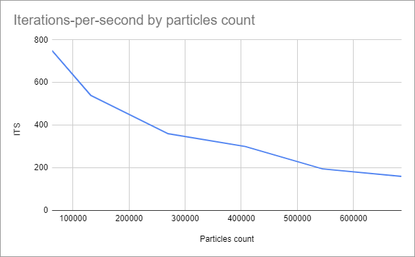
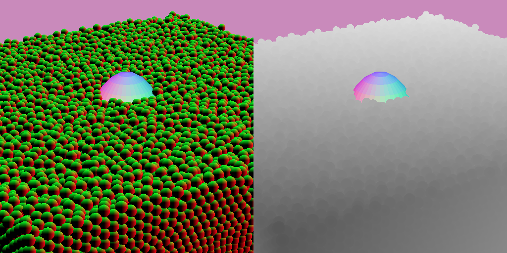

# balls-webgpu

## Description


## Algorithms
### Engine
The simulation runs fully on the GPU: the CPU is only used to compute the initial positions.

#### Base principle
The physics are not the focus of this project, so they are pretty basic.

All particles in the scene share the same size. They evolve inside a delimited spatial domain (a unit cube). Particles collide with each other, so that there is no interpenetration. Particles are subject to gravity. I use Euler integration for each step.

In the scene there can be obstacles. They are modeled as special particles that do not move, so in case of collision between a mobile particle and an obstacle's particle, it is the mobile particle that absorbs the energy and bounces back. For the rendering, the obstacles are rendered as meshes, but this is only for display.

<div style="text-align:center">
    
    <p>
        <i>Obstacle modeled as particles.</i>
    </p>
</div>

#### Spatial indexing
A naive implementation of these equations would be, for each sphere to check every other sphere for collision. However:
- this is obviously not scalable;
- this is wasting a lot of resources, because if two spheres are too far from one another, there is no need to compute their interaction.

The solution to both these issues is to use spatial indexing, so that:
- each particle only checks the particles near it and skips the ones far away;
- particles that are spatially close are adjacent in the `GPUBuffer`, which is favorable for GPU cache.

Spatial indexing works well on GPU, but requires an adapted implementation, different from a classical CPU one.

In my explanation, I will consider a 2D domain to make diagrams readable; however in my project I use 3D indexing. This technique can be generalized to higher dimensions if needed.

Let take the example of a scene where there are spheres of radius `r`. I divide the domain into a regular grid, where the cell size at least `2r`. This way if a sphere is in a certain cell, then the only other spheres potentially colliding are the ones in the same cell, or in the 9 adjacent cells.

In this example there are 7 spheres (in blue), and the domain is divided into 16 cells (in black). Each cell is given a unique scalar identifier.
<div style="text-align:center">
    
</div>

Then I count the number of spheres in each cell (`pCount` in these diagrams), and I assign a local id to each sphere (in blue).
<div style="text-align:center">
    
</div>

Then I compute a prefix sum (exclusive scan): the `cStart` of each cell is the sum of the `pCount` of the previous cells.
<div style="text-align:center">
    
</div>

Then to each particle, I assign a global id (in red) which is the sum of the cell's `cStart` and the particle's local id. This global id is unique to each particle, and is then used to reorder particles.
<div style="text-align:center">
    
</div>

Finally, I reorder the particles according to their global id.

Once this indexing is done:
- the particles were reordered;
- I easily can get the list of particles in a cell: they are the ones with ids ranging from `cStart` to `cStart + pCount`.

In this example, let's say I want to compute the collisions for particle 1.
- I start by computing the cell id (cell #2)
- I then lookup particles in adjacent cells (#1, #2, #3, #5, #6, #7): in cells #1,#3,#5,#6 `pCount=0` so no particles, in cell #2 particles `0` to `0+3` (0, 1, 2), in cell #7 particles `5` to `5+1` (5).

Here is what indexing looks like (only the cells with `pCount>0` are displayed):

https://user-images.githubusercontent.com/22922087/228377674-6cc242ab-d291-4367-823d-86c9c04d8297.mp4

#### Performance
Unfortunately, at the time of writing I did not find an easy way of precisely monitoring performance. I don't know, of physics or spatial indexing, which takes the most computing time. The only metric I have is the iterations per second (one iteration being spatial indexing + physics computing).

Here is the evolution of the iterations per second relatively to the particles count. Measures were done on my desktop computer with an nVidia 1660 Ti, with particles of radius 0.005, and a grid size of 98x98x98 (9411952 cells of 0.0102 each).
<div style="text-align:center">
    
    <p>
        <i>Iterations-per-second by particles count.</i>
    </p>
</div>

Tweaking the grid size (as long as it respects the minimum cell size condition) will certainly affect performance too; however I did not perform any tests of this kind to determine the ideal size.

### Rendering
The project supports two render modes:
- balls, which is the cheapest one
- water, which is the most expensive one

These modes are purely cosmetic and don't affect the simulation in any way. In both modes I use deferred rendering.
Below, examples of both rendering modes for a same scene, comprising a central obstacle partially submerged.
<div style="text-align:center">
    
    <p>
        <i>"Balls" rendering mode.</i>
    </p>
</div>
<div style="text-align:center">
    
    <p>
        <i>"Water" rendering mode.</i>
    </p>
</div>

#### "Balls" rendering mode
This rendering mode of rendering is the most straightforward one.

Each ball is first rendered as a 2D billboard, which each fragment containing the billboard-local position in the red/green channels. Since the balls are really close to one another, a simple 2D billboard is not enough: I have to manually compute the depth in the fragment shader to mimic the shape of the sphere. In my tests, for large amounts of spheres this is still cheaper than using actually 3D geometry.
The depth is stored in the alpha channel. Since it is only 8 bits, I need to carefully chose the camera near and far planes to maximize useful range.
<div style="text-align:center">
    
    <p>
        <i>In RG channels, local position. In alpha channel, depth.</i>
    </p>
</div>

Then at composition-time, I compute the world normal by combining the billboard-local position and the camera properties:
<div style="text-align:center">
    
    <p>
        <i>Computed world normals.</i>
    </p>
</div>

and from there it is easy to compute a basic diffuse shading:
<div style="text-align:center">
    
    <p>
        <i>Final balls shading with diffuse lighting.</i>
    </p>
</div>

#### "Water" rendering mode
This rendering mode is way more expensive but has a cartoonish water look that I like. Everything happens in screen-space: no additional geometry is required.

The first step is common with the "balls" rendering mode: I render each sphere as a billboard. This time however, I use all 4 channels of the texture and I store in the blue channel the water depth (computed in additive mode).
<div style="text-align:center">
    
    <p>
        <i>In RG channels, local position. In blue channel, water depth. In alpha channel, depth.</i>
    </p>
</div>

In a second step, I apply a blur to try to merge the spheres together.
<div style="text-align:center">
    
    <p>
        <i>Same texture, with local position and water depth blurred.</i>
    </p>
</div>

This blur is applied in a compute shader. It is computed in two steps as a separable Gaussian blur: first vertical, then horizontal. For better performance, I first load the region into workgroup cache, then work on that cache.  It takes depth into account, in order to keep edges sharp: if there is a discontinuity in depth, then no blur is applied. Otherwise, a sphere in the foreground would be merged with the water in the background, which makes no sense visually.
<div style="text-align:center">
    
    <p>
        <i>Where there is a depth discontinuity, no blur is applied.</i>
    </p>
</div>

In the last step, all this information is combined, and with a bit of Fresnel and specularity here is the result:
<div style="text-align:center">
    
    <p>
        <i>Here is what the shaded water looks like.</i>
    </p>
</div>

I am especially happy with the water depth information, which greatly improves the rendering since it allows to see obstacles through the water. This effect is visible in the video below:

https://user-images.githubusercontent.com/22922087/228359283-33cc019e-f49b-4865-9906-eb5b36fb7920.mp4

## Implementation details
I used this project to further learn about WebGPU (which at the time of writing, is still in draft so things could change in the future). Below are specific implementation details I think are notable.

### Water depth: additive blending and write masks
I was a bit worried about the computation of the water depth. However it turned out to be easy because WebGPU supports:
- additive blending
```typescript
const additiveBlend: GPUBlendState = {
    color: {
        srcFactor: "one",
        dstFactor: "one",
        operation: "add",
    },
    alpha: {
        srcFactor: "one",
        dstFactor: "one",
        operation: "add",
    }
};
```
- and write mask
```typescript
const colorTarget: GPUColorTargetState = {
    format: "rgba8unorm",
    writeMask: GPUColorWrite.BLUE, // or GPUColorWrite.RED | GPUColorWrite.GREEN | GPUColorWrite.ALPHA
};
```

This is necessary because the RGA channels of the deferred texture store the scene rendered classically (with depth write) whereas the B channel stores the scene in additive mode without depth write: as a result I cannot compute all four channels at the same time, I have to perform 2 renders into the same texture. I first render the RGA channels with a RGA writeMask and `depthWriteEnabled=true`, and then I do a second render for the B channel, with a B writeMask and `depthWriteEnabled=false`.

### Blur: compute shaders, workgroup address space and workgroupBarrier
In the "Water" render mode, I have to blur the deferred texture. In WebGL1, I would have used a fragment shader to do this. In WebGPU, there is support for compute shader, which offers more control, flexibility and performance !

The blur is computed as a separable Gaussian blur: first a horizontal blur is applied, then a vertical one. The principle of a blur is to sample the neighbouring fragments and sum them, with normalized weights. A direct way of doing this would be, for each texel, to fetch the neighbouring texels directly from the texture. However this proves to be sub-optimal because then each texel would be fetched many times, and a fetch is expensive. A more performant way of doing this is to minimize texel fetches by using a cache in the workgroup address space. This is made possible with the use of the [`workgroupBarrier()`](https://www.w3.org/TR/WGSL/#workgroupBarrier-builtin) instruction.

You can find such an example in the [webgpu-samples](https://github.com/webgpu/webgpu-samples/blob/main/src/sample/imageBlur/blur.wgsl).

Below is a simplified example. In real life there is some more code to handle out-of-bounds reads.
```glsl
@group(0) @binding(0) var inputTexture: texture_2d<f32>; // input texture
@group(0) @binding(1) var outputTexture: texture_storage_2d<rgba8unorm, write>; // output texture

struct ComputeIn {
    @builtin(workgroup_id) workgroupId: vec3<u32>,
    @builtin(local_invocation_id) localInvocationId: vec3<u32>,
    @builtin(global_invocation_id) globalInvocationId: vec3<u32>,
};

const direction = vec2<i32>(1,0); // horizontal blur
const workgroupSize = 128;
const blurRadius = 6;

var<workgroup> workgroupCache : array<vec4<f32>, workgroupSize>; // cache stored in the workgroup address space

@compute @workgroup_size(workgroupSize)
fn main(in: ComputeIn) {
    let textureSize = vec2<i32>(textureDimensions(inputTexture));
    let globalInvocationId = vec2<i32>(in.globalInvocationId.xy) - vec2<i32>(2 * blurRadius * i32(in.workgroupId.x), 0);

    let texelId = globalInvocationId.x * direction + globalInvocationId.y * (vec2<i32>(1) - direction);
    let indexInCache = i32(in.localInvocationId.x);

    // first, load workgroup cache, one single texel fetch per invocation
    let currentFragment = textureLoad(inputTexture, texelId, 0); // texel fetch (might be out of texture range)
    workgroupCache[indexInCache] = currentFragment; // write in workgroup cache

    // wait for every invocation of in the workgroup
    workgroupBarrier();
    // at this point the workgroupCache stores a copy of a portion of the texture

    // then compute blur by loading values from workgroupCache
    if (texelId.x < textureSize.x && texelId.y < textureSize.y) {
        var blurred = vec4<f32>(0);

        // loop on items from indexInCache-blurRadius to indexInCache+blurRadius
        for (let i = indexInCache-blurRadius; i <= indexInCache+blurRadius; i++) {
            blurred += workgroupCache[i];
        }
        blurred /= 2.0 * f32(blurRadius) + 1.0;

        // then store the result in the output texture
        textureStore(outputTexture, texelId, blurred);
    }
}
```

### Uniforms buffer packing
In GLSL when creating a structure, each attribute has requirements in terms of bytes alignment (and stride in case of arrays). Correctly packing a structure to minimize space requires a bit of care. Everything is explained in the [Alignment and Size](https://www.w3.org/TR/WGSL/#alignment-and-size) section of the spec.

Here is an example of a structure that could be packed better:
```glsl
struct Particle {            //            align(16) size(64)
    position: vec3<f32>,     // offset(0)  align(16) size(12)
    // 4 bytes wasted
    velocity: vec3<f32>,     // offset(16) align(16) size(12)
    // 4 bytes wasted
    acceleration: vec3<f32>, // offset(32) align(16) size(12)
    weight: f32,             // offset(44) align(4)  size(4) 
    foam: f32,               // offset(48) align(4)  size(4) 
    indexInCell: u32,        // offset(52) align(4)  size(4) 
    // 8 bytes wasted
};
```
Since `SizeOf(vec3<f32>) = 12` and `AlignOf(vec3<f32>) = 16`, in this example there is a 4-bytes gap between `position`, `velocity` and `acceleration`. This wastes 8 bytes in padding. Worse it makes the structure 16 bytes too big because the `size` of a structure needs to be a multiple of its `align`: here, even if the used size would have been 56 bytes, there is more padding added at the end.
A better way to pack this structure would be to use this padding to store the 4-bytes types like so:
```glsl
struct Particle {            //            align(16) size(48)
    position: vec3<f32>,     // offset(0)  align(16) size(12)
    weight: f32,             // offset(12) align(4)  size(4) 
    velocity: vec3<f32>,     // offset(16) align(16) size(12)
    foam: f32,               // offset(28) align(4)  size(4) 
    acceleration: vec3<f32>, // offset(32) align(16) size(12)
    indexInCell: u32,        // offset(44) align(4)  size(4) 
};
```
This way, no space is wasted and the structure is 75% smaller, down to 48 bytes instead of 64 ! This can seem anecdotal but has a huge impact in my project where I store 100000s of particles: it can save dozens of megabytes of GPU memory.

For large structures this is a bit tedious to tweak the attributes manually, so I created a helper class to automatically pack structures as much as possible.

### Spatial indexing with atomicAdd
WebGPU offers atomic operations described in the "[Atomic Read-modify-write](https://www.w3.org/TR/WGSL/#atomic-rmw)" section of the spec. These allow several invocations to work in parallel on the same data in storage or workgroup address space without risking race conditions.

I use it in the step 2 of the spatial indexing process, to increment `pCount` the count of particles in each cell.
<div style="text-align:center">
    
</div>
In this step:
- the cell's `pCount` were previously reset to 0
- each invocation handles one particle.

The code snipet to increment the cells `pCount` and get the particle's local id is:
```glsl

struct Cell {
    pCount: atomic<u32>,
};

struct Particle {
    position: vec3<f32>,
    indexInCell: u32,
};

struct ComputeIn {
    @builtin(global_invocation_id) globalInvocationId : vec3<u32>,
};

@group(0) @binding(0) var<storage,read_write> cellsBuffer: array<Cell>;
@group(0) @binding(1) var<storage,read_write> particlesBuffer: array<Particle>;

override particlesCount: u32;

fn computeCellIndex(position: vec3<f32>) -> u32 {
    // compute it
}

@compute @workgroup_size(128)
fn main(in: ComputeIn) {
    let particleId = in.globalInvocationId.x;

    if (particleId < particlesCount) { // particlesCount might not be a multiple of 128, so a few invocations are wasted
        let position = particlesBuffer[particleId].position;
        let cellIndex = computeCellIndex(position);
        // atomicAdd increments the cell's pCount and return its value pre-incrementation
        particlesBuffer[particleId].indexInCell = atomicAdd(&cellsBuffer[cellIndex].pCount, 1u);
    }
}
```

### Prefix sum
Implementing prefix sum for parallel architectures is a well-known subject. I chose to implement a simple algorithm described below, which consists of two passes: the reduce pass and the down pass.

<div style="text-align:center">
    
    <p>
        <i>Prefix sum (exclusive scan) algorithm I used.</i>
    </p>
</div>

## Improvements
There are many ways this project could be improved.
On the engine side:
- I could use an Smoothed particle hydrodynamics (SPH) algorithm for more realistic physics;
- I could use a better integration scheme than Euler, even Verlet would be an improvement.
- currently, all obstacles are modeled by spheres. This works well but has a major disadvantage: it makes all obstacles bumpy. For instance, balls don't roll well on mild slopes. This leaves a lot of room for improvement.

On the rendering side:
- another way to render water from spheres would be to recontruct the water surface, for instance with marching cubes. This is a great subject in itself and implementing it on GPU would be interesting.
- another way to compute water depth, without additive blending, would be to do a two-passes rendering: the first one to retrieve the depth of the backFaces, and then the second one computing the difference between the front face's depth. An adavantage of this method is that is also works with mesh geometry.
