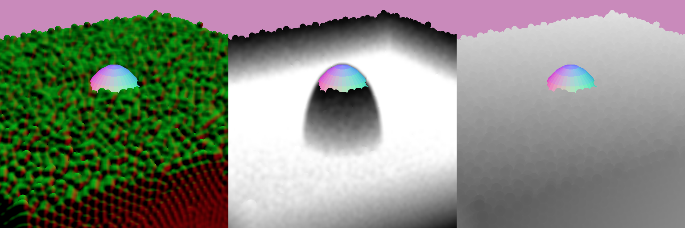

# balls-webgpu

## Description
TODO

## Implementation
### Rendering
The project supports two modes of render:
- balls, which is the cheapest one
- water, which is the most expensive one

These modes are purely cosmetic and don't affect the simulation in any way. In both modes I use deferred rendering.

Below, example of both rendering modes for a same scene, comprising a central obstacle partially submerged.

*"Balls" rendering mode*

*"Water" rendering mode*

#### "Balls" rendering mode
This rendering mode of rendering is the most straightforward one.

Each ball is first rendered as a 2D billboard, which each fragment containing the billboard-local position in the red/green channels. The depth is stored in the alpha channel. Since the balls are really close to one another, a simple 2D billboard is not enough: I have to manually compute the depth in the fragment shader to mimic the shape of the sphere. In my tests, for large amounts of spheres this is still cheaper than using actually 3D geometry.

*In RG channels, local position. In alpha channel, depth.*

Then at composition-time, I compute the world normal by combining the billboard-local position and the camera properties:

*Computed world normals*

and from there it is easy to compute a basic diffuse shading:

*Final shading with diffuse lighting*

#### "Water" rendering mode
This rendering mode is way more expensive but has a cartoonish water look that I like. Everything happens in screen-space: no additional geometry is required.

The first step is common with the "balls" rendering mode: I render each sphere as a billboard. This time however, I use all 4 channels of the texture and I store in the blue channel the cumulated depth.

*In RG channels, local position. In blue channel, water depth. In alpha channel, depth.*

In a second step, I apply a blur to try to merge the spheres together.

*Same texture, with local position and water depth blurred*
This blur is applied in a compute shader. It is computed in two steps as a separable gaussian blur: first vertical, then horizontal. For better performance, I first load the region into workgroup cache, then work on that cache.  It takes depth into account, in order to keep edges sharp: if there is a discontinuity in depth, then no blur is applied. Otherwise, a sphere in the foreground would be merged with the water in the background, which makes no sense visually.

*Where there is a depth discontinuity, no blur is applied.*

In the last step, all this information is combined, and with a bit of fresnel and specularity here is the result:

*Here is what the shaded water looks like*

I am especially happy with the water depth information, which greatly improves the rendering since it allows to see obstacles through the water. It is visible in the video below:
